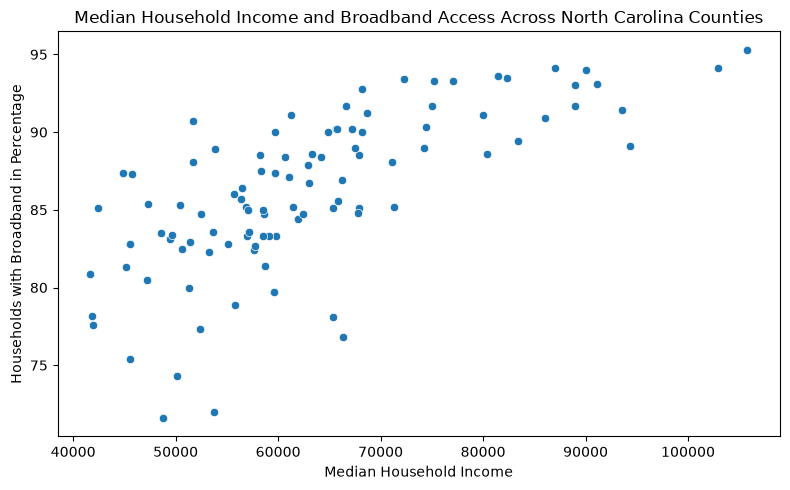
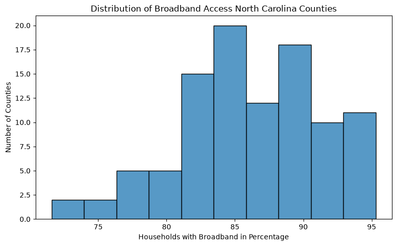

## Project 1

### Research Question
How is median household income associated with broadband subscription rates across North Carolina counties?
### Dataset
The dataset comes from the U.S. Census Bureau’s 2024 American Community Survey (ACS) 5-Year Estimates through the Census API and contains county-level data for North Carolina, with each row representing a county and including median household income, broadband subscription rates, and computer ownership percentages. Dataset size : 100 counties with no missing values found. 
### Variables 
- **Median Household Income:** The income (in dollars) for each North Carolina county.
- **Broadband Subscription Rate:** The percentage of households in each county with a broadband internet subscription.
- **Unit of Analysis:** North Carolina counties.
 
### Data Cleaning and Preparation

target_cols = ["Median_Household_Income", "Pct_Broadband", "Pct_Computer"]
df[target_cols] = df[target_cols].apply(pd.to_numeric, errors="coerce")
df = df.dropna(subset=target_cols)
The code converts the selected variables to numeric values, removing rows with missing data.
### Visualizations

The scatterplot shows that counties with higher median household incomes generally have higher broadband subscription rates.

The histogram shows how broadband subscription rates are distributed across North Carolina counties, including where most counties fall and how much the rates vary.

### Limitations

The data are at the county level, so they do not show differences between individual households. Other factors may also affect broadband subscription rates. The analysis shows an association between income and broadband subscription rates but does not show causation.

### Key Academic References
Agarwal, A., Canfield, C., & Khan, M. N. (2024). Analysis of rural broadband adoption dynamics: A theory-driven agent-based model. *PLOS ONE, 19*(6), e0302146. https://doi.org/10.1371/journal.pone.0302146

Rosston, G. L., & Wallsten, S. J. (2020). Increasing low-income broadband adoption through private incentives. *Telecommunications Policy, 44*(9), 102020. https://doi.org/10.1016/j.telpol.2020.102020

Silva, S., Badasyan, N., & Busby, M. (2018). Diversity and digital divide: Using the National Broadband Map to identify the non-adopters of broadband. *Telecommunications Policy, 42*(5), 361–373. https://doi.org/10.1016/j.telpol.2018.02.008

### Source
U.S. Census Bureau — 2024 American Community Survey (ACS) 5-Year Estimates.

### Code
[View project code](../project1_data.ipynb)

