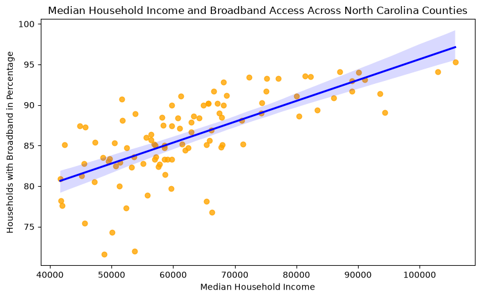
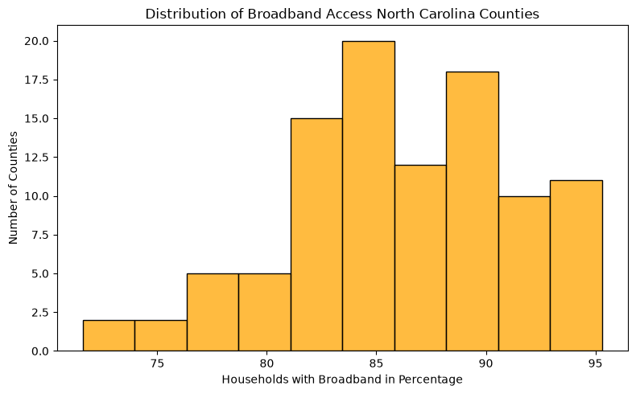

## Project 2
--- 
### Research Question
How is median household income associated with median gross rent across North Carolina counties?

I chose this question because housing affordability is a critical concern for communities, impacting cost of living and financial stability. At the same time, not every community experiences the same rental costs. I wanted to see if household income is related to these differences across North Carolina counties. This could be useful for understanding regional housing markets and for people who make decisions about affordable housing resources. The results can show whether counties with higher incomes tend to have higher median gross rents, although they cannot explain why those differences exist.

### Dataset
The dataset comes from the U.S. Census Bureau’s 2024 American Community Survey (ACS) 5-Year Estimates through the Census API and contains county-level data for North Carolina, with each row representing a county and including median household income and median gross rent. Dataset size : 100 counties with no missing values found. 

### Variables 
- **Median Household Income:** The income (in dollars) for each North Carolina county.
- **Median Gross Rent:** The median gross rent (in dollars) for each North Carolina county.
- **Unit of Analysis:** North Carolina counties.
 
### Data Cleaning and Preparation

target_cols = ["Median_Household_Income", "Median_Gross_Rent"]
df[target_cols] = df[target_cols].apply(pd.to_numeric, errors="coerce")
df = df.dropna(subset=target_cols)
The code converts the selected variables to numeric values, removing rows with missing data.

### Visualizations

The scatterplot shows that counties with higher median household incomes generally have higher median gross rents.

The histogram shows how median gross rents are distributed across North Carolina counties, including where most counties fall and how much the rents vary.

### Limitations
The data are at the county level, so they do not show differences between individual households. Other factors may also affect median gross rent and housing affordability.

--- 

### Summary
The results show that counties with higher median household incomes generally have higher median gross rents. This answers the research question by showing that median household income is positively associated with median gross rent across North Carolina counties.

### Key Academic References
Desmond, M., & Gershenson, C. (2016). Housing poverty and the socioeconomic makeup of neighborhoods. *American Journal of Sociology, 121*(5), 1543–1587. https://doi.org/10.1086/684534
Quigley, J. M., & Raphael, S. (2004). Is housing unaffordable? Why isn't it more affordable? *Journal of Economic Perspectives, 18*(1), 191–214. https://doi.org/10.1257/089533004773563487
Gyourko, J., Mayer, C., & Sinai, T. (2006). Supercities. *Journal of Urban Economics, 60*(2), 158–184. https://doi.org/10.1016/j.jue.2006.03.002

### Code
[View project code](https://github.com/Sal-ah-cmd/data-structures-portfolio/blob/main/files/project2_data.ipynb)
